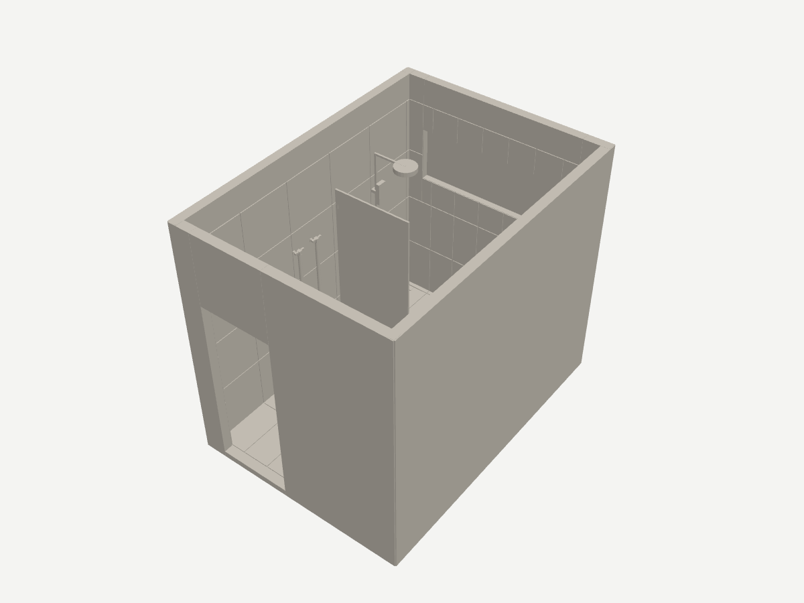

# Bathroom Concept: 3D print, 1:20

Generated by `npm run print-3d` from the same model as the drawings: the finished room, open top, with every fixture at its set-out.

- [bathroom-1to20.3mf](bathroom-1to20.3mf): open this in Bambu Studio. One object of 18 named parts (shell, wall and floor tiles, each fixture), so a part can take its own filament on an AMS.
- [bathroom-1to20.stl](bathroom-1to20.stl): the same, one mesh, for any slicer.

Size 119.0 × 164.5 × 138.5 mm (W × D × H), centred on a 256 mm bed. 1 mm on the print is 20 mm in the room. North (the window wall) is at the back of the plate.

## Printing on a Bambu

1. Bambu Studio → File → Import → the .3mf. If it asks, load it as a single object with multiple parts. Do not scale it.
2. 0.4 mm nozzle, 0.12–0.16 mm layers for the detail (0.2 mm works, coarser). PLA.
3. Supports on, type tree (auto), threshold angle 30°: the shower head arm, the towel rails, the mixers and the shaving cabinet hang off the walls. The walls, window recess and door need none.
4. Brim off; the 3 mm base is wide and flat. 2 wall loops is enough (walls are 5 mm).
5. One colour prints fine: the tiles are a 0.5 mm relief with joints widened to 0.4 mm. With an AMS, give the floor tiles and window-wall tiles beige, the other wall tiles white and the fittings grey or silver.

## What is exaggerated for printing

- Walls are 100 mm thick behind the finished face (5.0 mm printed), on a 3.0 mm base; the room inside is to scale.
- Tile joints are printed at least 0.4 mm wide (4 mm joints would be 0.2 mm) and the tiles stand 0.5 mm proud.
- Any fixture part thinner than 1.0 mm printed (levers, the shower rail, the 10 mm glass screen) is thickened to 1.0 mm about its own centre.
- The window is a recess with a 1.5 mm pane; the door opening is open.
- The linear drain is a slot in the floor tiles; the Kano tile-insert waste is tiled over, as built.

Proposed design, for showing the layout: dimension from the drawings, not from the print.
