# Stage diagram pack: Bathroom Concept

Generated by `npm run stage-pack` from the shipped sample. Each phase is a stage view: the same model with only the listed layers visible. Nothing in the model is edited to make a phase look right.

Every drawing is proposed set-out for trade review, not a compliance certificate. Values print with their status tag and datum; "?" means unknown.

## 1. Post-demolition: frame and slab

Walls stripped to the timber frame and the floor taken back to the concrete slab, about 120 mm below the current tile (estimated; confirm after demolition). The door and window openings stay as openings in the frame.

Visible: `walls`, `wall-frame`, `rooms`, `doors`, `windows`, `floor-substrate`

Specification: 28 row(s), 13 unknown. [spec.html](01-post-demolition/spec.html)

Not modelled (never drawn):

- pipe and cable runs between service points (only the points are modelled)

### Plan

[plan.svg](01-post-demolition/plan.svg)

### Elevation wall_n (right side, from Bathroom)

[elevation-wall_n-right.svg](01-post-demolition/elevation-wall_n-right.svg)

### Elevation wall_e (right side, from Bathroom)

[elevation-wall_e-right.svg](01-post-demolition/elevation-wall_e-right.svg)

### Elevation wall_s (right side, from Bathroom)

[elevation-wall_s-right.svg](01-post-demolition/elevation-wall_s-right.svg)

### Elevation wall_w (right side, from Bathroom)

[elevation-wall_w-right.svg](01-post-demolition/elevation-wall_w-right.svg)

## 2. Frame prep: board lined to the frame

The 6 mm Villaboard lined to the frame wall by wall. Board thickness and the frame positions are as recorded; where either is unknown the drawing prints '?'.

Visible: `walls`, `wall-frame`, `wall-board`, `rooms`, `doors`, `windows`, `floor-substrate`

Specification: 40 row(s), 13 unknown. [spec.html](02-frame-board/spec.html)

Not modelled (never drawn):

- pipe and cable runs between service points (only the points are modelled)

### Plan

[plan.svg](02-frame-board/plan.svg)

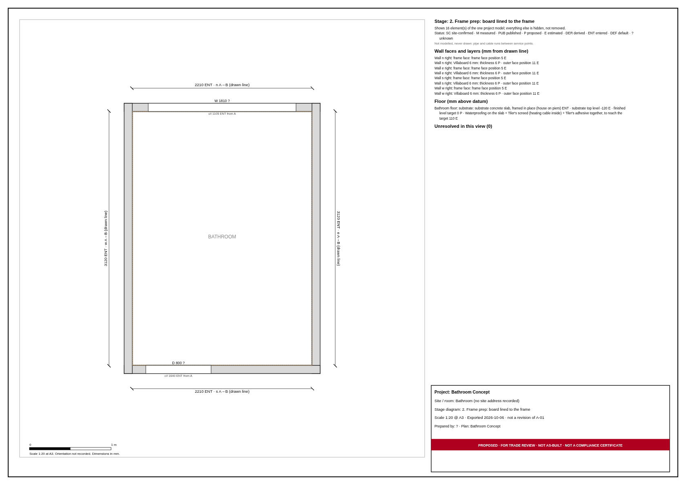

### Elevation wall_n (right side, from Bathroom)

[elevation-wall_n-right.svg](02-frame-board/elevation-wall_n-right.svg)

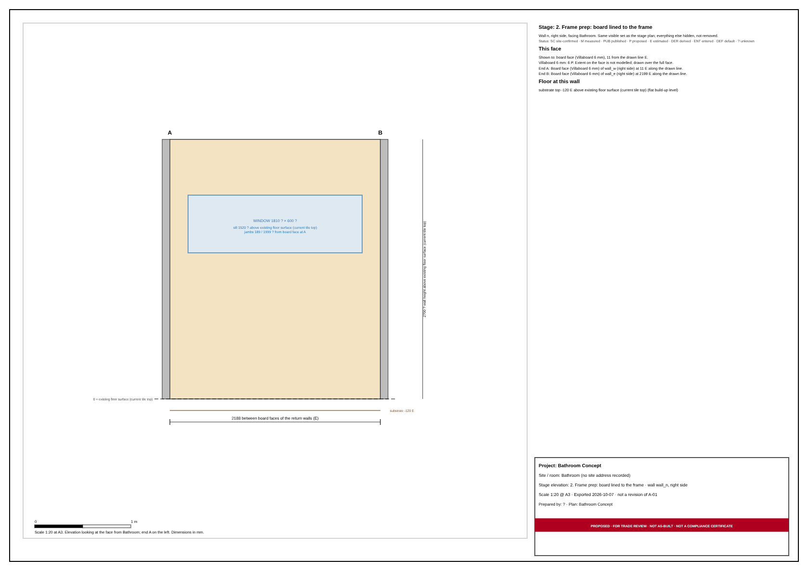

### Elevation wall_e (right side, from Bathroom)

[elevation-wall_e-right.svg](02-frame-board/elevation-wall_e-right.svg)

### Elevation wall_s (right side, from Bathroom)

[elevation-wall_s-right.svg](02-frame-board/elevation-wall_s-right.svg)

### Elevation wall_w (right side, from Bathroom)

[elevation-wall_w-right.svg](02-frame-board/elevation-wall_w-right.svg)

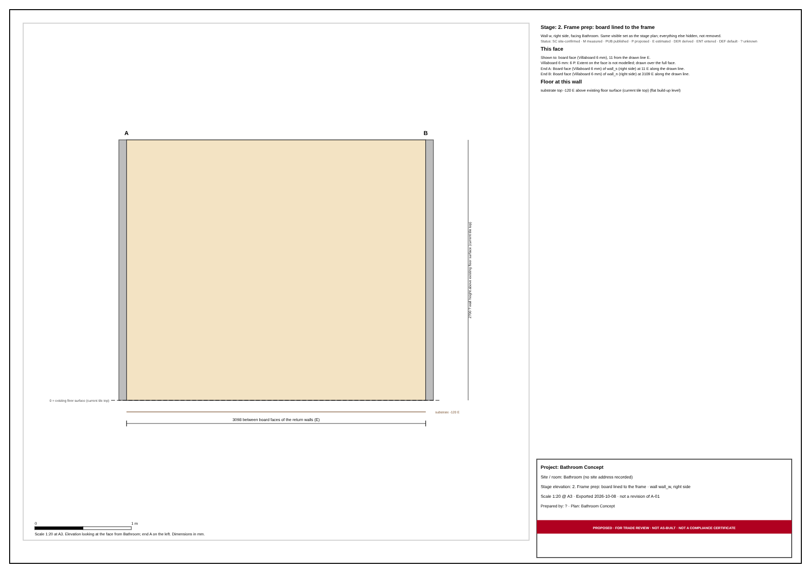

## 3. Rough-in: frame and drains (stopgap)

Stopgap view. Plumbing and electrical rough-in is the stage, but the sample records no waste, water or power service points, so this shows the frame and the two floor drains (dashed) and prints the service points as not recorded. Pipe and cable runs are never drawn.

Visible: `walls`, `wall-frame`, `rooms`, `doors`, `windows`, `floor-substrate`, `drainage-wastes`

Stopgap view, not recorded: Waste service points; Water service points; Power service points. Drawn dashed as stand-ins: drainage-wastes.

Specification: 45 row(s), 18 unknown. [spec.html](03-rough-in/spec.html)

Open items:

- Bathroom: Lauxes Next Gen 35 channel 1000 × 100 × 35, brushed nickel, 50 mm outlet WO50-BN: finished level at waste (mm) unknown; printed as "?" (missing finished level at waste (mm)).
- Bathroom: Lauxes Next Gen 35 channel 1000 × 100 × 35, brushed nickel, 50 mm outlet WO50-BN: outlet position unknown; printed as "?" (missing outlet position along the channel (entered on the waste), outlet sideways offset (brief)).
- Bathroom: Kano 316 tile-insert waste 120 × 120, brushed nickel, 50 mm outlet: finished level at waste (mm) unknown; printed as "?" (missing finished level at waste (mm)).
- Bathroom: Kano 316 tile-insert waste 120 × 120, brushed nickel, 50 mm outlet: body depth below grate (mm) unknown; printed as "?" (missing installation depth not in the Kano 316 Tile Insert Waste 120×120, brushed nickel brief).
- Bathroom: Kano 316 tile-insert waste 120 × 120, brushed nickel, 50 mm outlet: outlet position unknown; printed as "?" (missing outlet sideways offset, outlet from body back edge, body depth (envelope) (brief)).

Not modelled (never drawn):

- pipe and cable runs between service points (only the points are modelled)

### Plan

[plan.svg](03-rough-in/plan.svg)

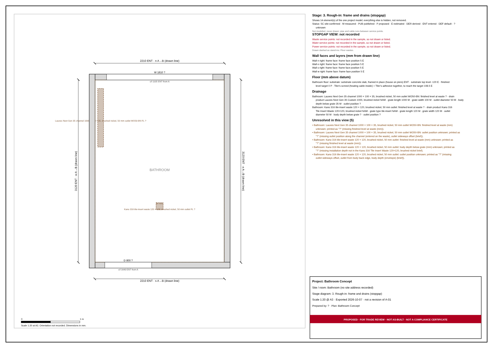

### Elevation wall_n (right side, from Bathroom)

[elevation-wall_n-right.svg](03-rough-in/elevation-wall_n-right.svg)

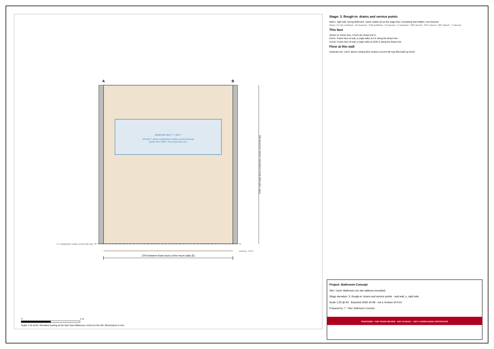

### Elevation wall_e (right side, from Bathroom)

[elevation-wall_e-right.svg](03-rough-in/elevation-wall_e-right.svg)

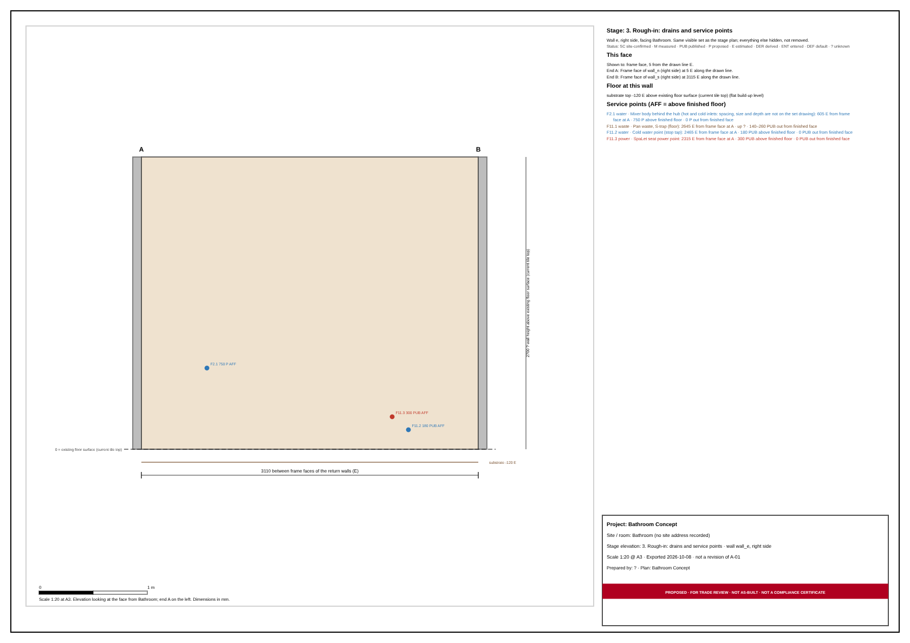

### Elevation wall_s (right side, from Bathroom)

[elevation-wall_s-right.svg](03-rough-in/elevation-wall_s-right.svg)

### Elevation wall_w (right side, from Bathroom)

[elevation-wall_w-right.svg](03-rough-in/elevation-wall_w-right.svg)

## 4. Waterproofing: floor membrane only (stopgap)

Stopgap view. The sample records the floor membrane but no wall waterproofing, so this shows the floor membrane (dashed level) over the substrate and prints the wall membrane as not recorded.

Visible: `walls`, `wall-frame`, `wall-board`, `rooms`, `doors`, `windows`, `floor-substrate`, `floor-waterproofing`, `drainage-wastes`

Stopgap view, not recorded: Wall waterproofing membrane. Drawn dashed as stand-ins: floor-waterproofing.

Specification: 60 row(s), 20 unknown. [spec.html](04-waterproofing/spec.html)

Open items:

- Bathroom floor: Waterproofing on the slab: thickness (mm) unknown; printed as "?" (missing thickness (mm)).
- Bathroom floor: Waterproofing on the slab: top level (mm) unknown; printed as "?" (missing Waterproofing on the slab thickness).
- Bathroom: Lauxes Next Gen 35 channel 1000 × 100 × 35, brushed nickel, 50 mm outlet WO50-BN: finished level at waste (mm) unknown; printed as "?" (missing finished level at waste (mm)).
- Bathroom: Lauxes Next Gen 35 channel 1000 × 100 × 35, brushed nickel, 50 mm outlet WO50-BN: outlet position unknown; printed as "?" (missing outlet position along the channel (entered on the waste), outlet sideways offset (brief)).
- Bathroom: Kano 316 tile-insert waste 120 × 120, brushed nickel, 50 mm outlet: finished level at waste (mm) unknown; printed as "?" (missing finished level at waste (mm)).
- Bathroom: Kano 316 tile-insert waste 120 × 120, brushed nickel, 50 mm outlet: body depth below grate (mm) unknown; printed as "?" (missing installation depth not in the Kano 316 Tile Insert Waste 120×120, brushed nickel brief).
- Bathroom: Kano 316 tile-insert waste 120 × 120, brushed nickel, 50 mm outlet: outlet position unknown; printed as "?" (missing outlet sideways offset, outlet from body back edge, body depth (envelope) (brief)).

Not modelled (never drawn):

- pipe and cable runs between service points (only the points are modelled)

### Plan

[plan.svg](04-waterproofing/plan.svg)

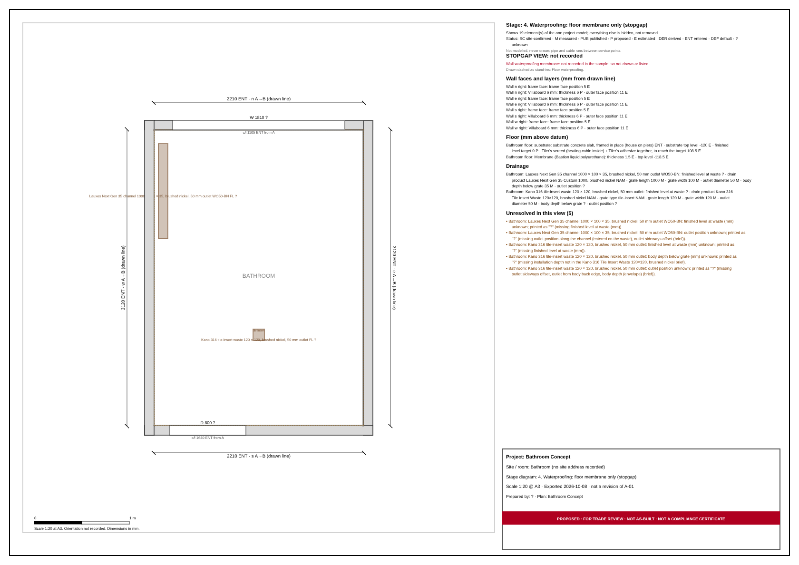

### Elevation wall_n (right side, from Bathroom)

[elevation-wall_n-right.svg](04-waterproofing/elevation-wall_n-right.svg)

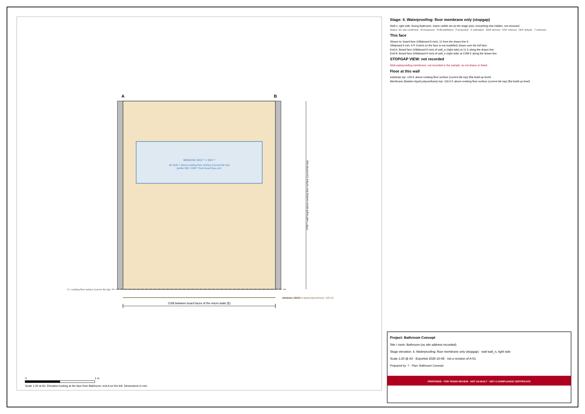

### Elevation wall_e (right side, from Bathroom)

[elevation-wall_e-right.svg](04-waterproofing/elevation-wall_e-right.svg)

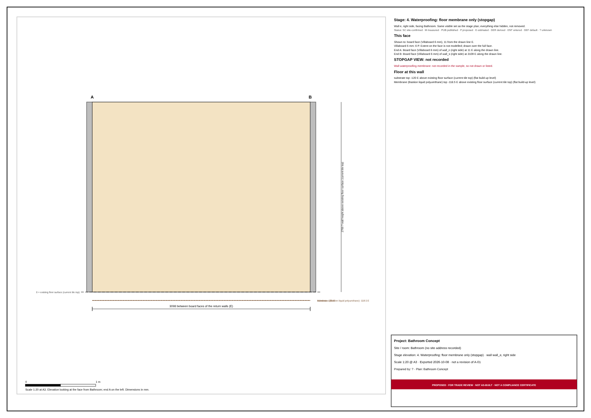

### Elevation wall_s (right side, from Bathroom)

[elevation-wall_s-right.svg](04-waterproofing/elevation-wall_s-right.svg)

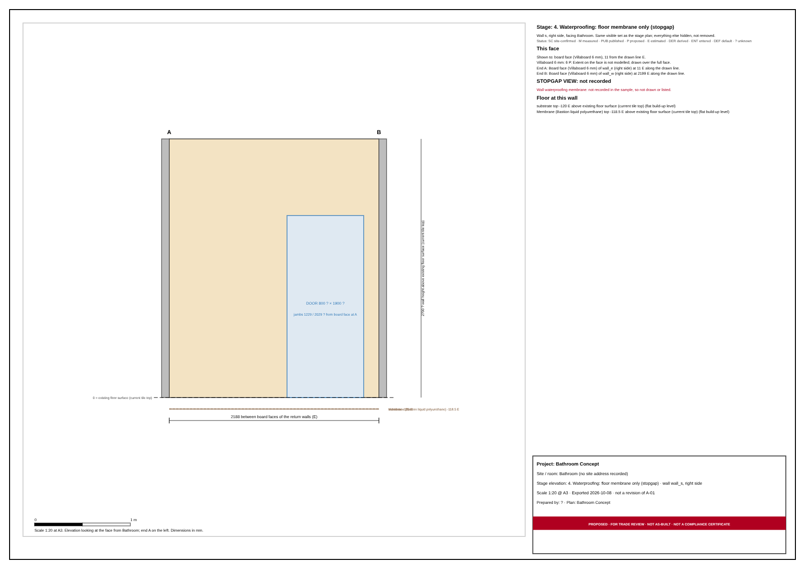

### Elevation wall_w (right side, from Bathroom)

[elevation-wall_w-right.svg](04-waterproofing/elevation-wall_w-right.svg)

## 5. Heating cable on the membrane

The proposed in-screed heating cable route, laid by the owner and tested by the electrician before the screed. The specification sheet is the compact one-page form: route points and cable levels on one row each. Proposed, pending manufacturer and electrician review.

Visible: `walls`, `wall-board`, `rooms`, `doors`, `windows`, `floor-substrate`, `floor-waterproofing`, `floor-heating-cable`, `drainage-wastes`

Specification: 80 row(s), 24 unknown. [spec.html](05-heating-cable/spec.html)

Open items:

- Bathroom floor: Waterproofing on the slab: thickness (mm) unknown; printed as "?" (missing thickness (mm)).
- Bathroom floor: Waterproofing on the slab: top level (mm) unknown; printed as "?" (missing Waterproofing on the slab thickness).
- Bathroom: proposed heating cable: heating_signoff: Proposed route only: manufacturer and licensed electrician must review cable identity, length, output, bend radius, spacing, exclusions, cover, sensor, cold tails, waterproofing and electrical installation. No compliance approval. No electrical approval is implied.
- Bathroom: proposed heating cable: heating_product_unresolved: sample-sck0765l-carton is not an accepted heating-cable in this library. Checks use the travelling snapshot only when its productId is that id or in its series.
- Bathroom: proposed heating cable: heating_product_unresolved: sample-mwd5-1999-cbp3 is not an accepted thermostat in this library. Checks use the travelling snapshot only when its productId is that id or in its series.
- Bathroom: proposed heating cable: heating_metadata_unknown: Unknown cable/product information: manufacturer, minSpacing, edgeClearance, depthFromBottom.
- Bathroom: proposed heating cable: heating_route_length_unknown: Spatial cable length and confirmed product-length balance remain unknown until the whole route has resolved screed levels and cable height; the plan projection is modelled, not cable length.
- Bathroom: proposed heating cable: heating_coverage_range: Zone area excluding entered keep-outs 6.3722 m² (availableArea, same resolver as evidence; not a laid-cable heat-coverage model) is outside the brief coverage range 3.7–5.1 m² (published, project-snapshot (unresolved), carton label — SCK0765L in-screed heating cable carton: coverage 3.7–5.1 m², minimum).
- Bathroom: proposed heating cable: heating_ip_location: Thermostat printed IP21 (published, carton label — Photographed MWD5-1999-CBP3 carton label: housing IP21) vs planned location outside a wet room (Hallway wall outside the bathroom, next to the light switch (right as you look into the bathroom), about 850 mm off the floor. Not drawn on this plan.; Owner, 5 Oct 2026). This check does not decide zone suitability; the electrician decides. No compliance approval.
- Bathroom: proposed heating cable: heating_depth_unknown: Cable section remains unresolved until screed layer, floor levels and cable height (bottom face of the selected screed layer (top of the layer below / subfloor stack); not the underside of the tile unless that face is the screed top) are entered.
- Bathroom: proposed heating cable: manufacturer unknown; printed as "?" (missing manufacturer).
- Bathroom: proposed heating cable: minSpacing (mm) unknown; printed as "?" (missing minSpacing (mm)).
- Bathroom: proposed heating cable: edgeClearance (mm) unknown; printed as "?" (missing edgeClearance (mm)).
- Bathroom: proposed heating cable: depthFromBottom (mm) unknown; printed as "?" (missing depthFromBottom (mm)).
- Bathroom: proposed heating cable: spatial route length, sampled profile (m) unknown; printed as "?" (missing Sampled cable profile. Modelled; unknown until screed levels and cable height resolve. Not published cable length.).
- Bathroom: proposed heating cable: remaining confirmed product length (m) unknown; printed as "?" (missing Balance stays unknown until confirmed product length and the whole spatial profile are both numeric.).
- Bathroom: proposed heating cable: cable level at 91 sampled points along plan route (mm) unknown; printed as "?" (missing plane "Dry area" is unresolved (missing Kano 316 tile-insert waste 120 × 120, brushed nickel, 50 mm outlet level, fall or a control level), cable height above screed bottom, Tiler's screed (heating cable inside) thickness, Tiler's adhesive thickness, plane "Shower" is unresolved (missing Lauxes Next Gen 35 channel 1000 × 100 × 35, brushed nickel, 50 mm outlet WO50-BN level, fall or a control level), plane "Beside the shower (under the bath)" is unresolved (missing Kano 316 tile-insert waste 120 × 120, brushed nickel, 50 mm outlet level, fall or a control level)).
- Bathroom: Lauxes Next Gen 35 channel 1000 × 100 × 35, brushed nickel, 50 mm outlet WO50-BN: finished level at waste (mm) unknown; printed as "?" (missing finished level at waste (mm)).
- Bathroom: Kano 316 tile-insert waste 120 × 120, brushed nickel, 50 mm outlet: finished level at waste (mm) unknown; printed as "?" (missing finished level at waste (mm)).

Not modelled (never drawn):

- pipe and cable runs between service points (only the points are modelled)

### Plan

[plan.svg](05-heating-cable/plan.svg)

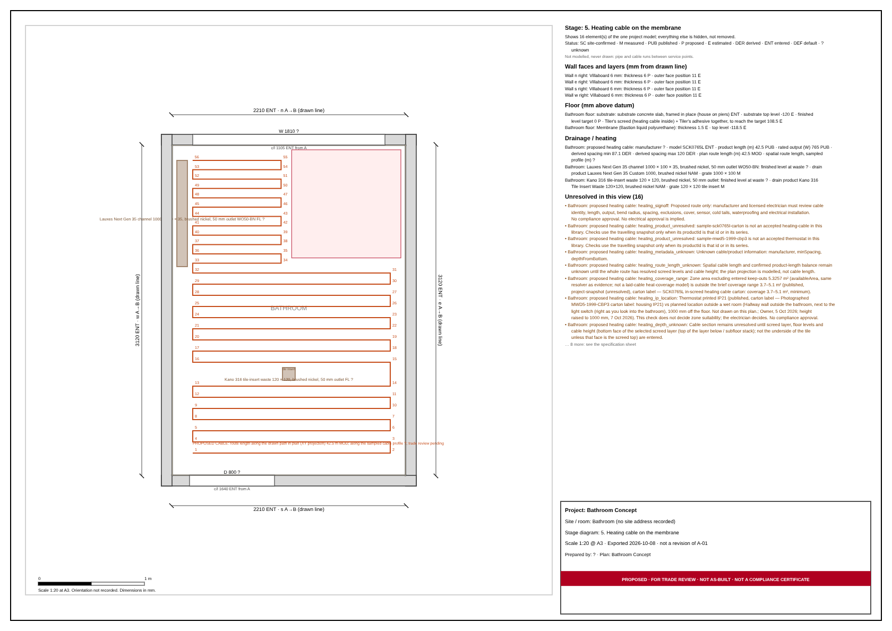

### Elevation wall_n (right side, from Bathroom)

[elevation-wall_n-right.svg](05-heating-cable/elevation-wall_n-right.svg)

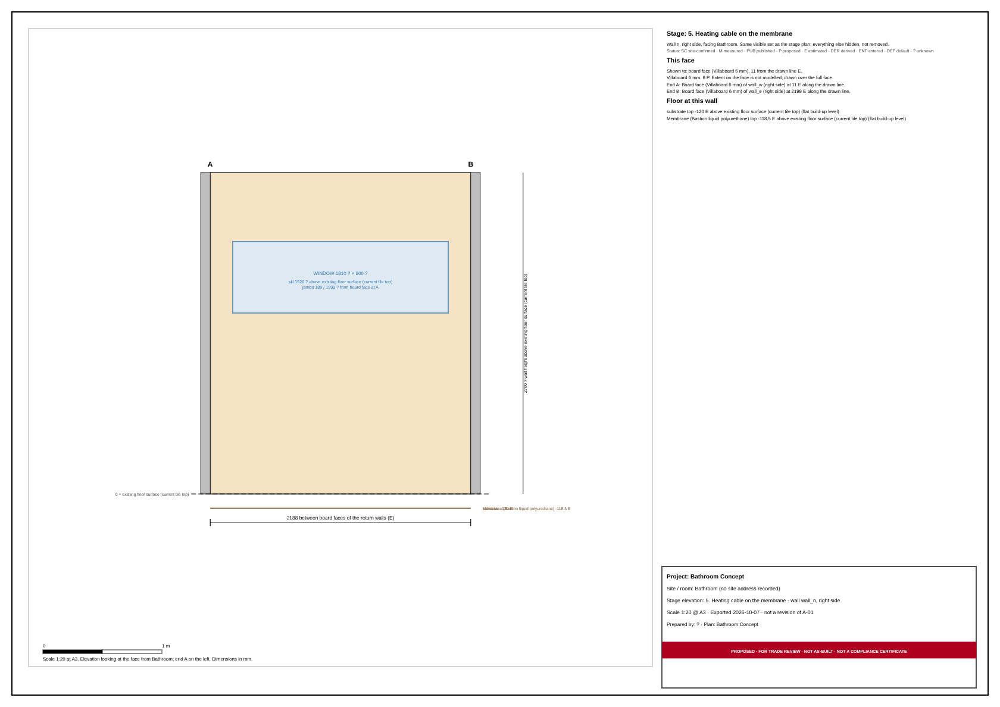

### Elevation wall_e (right side, from Bathroom)

[elevation-wall_e-right.svg](05-heating-cable/elevation-wall_e-right.svg)

### Elevation wall_s (right side, from Bathroom)

[elevation-wall_s-right.svg](05-heating-cable/elevation-wall_s-right.svg)

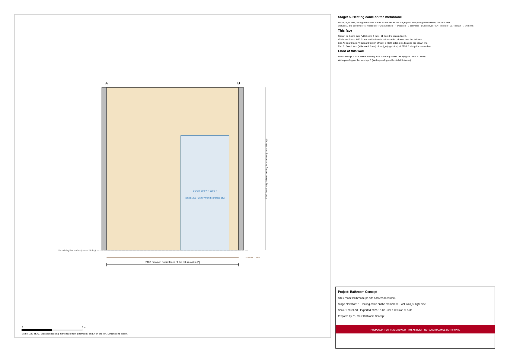

### Elevation wall_w (right side, from Bathroom)

[elevation-wall_w-right.svg](05-heating-cable/elevation-wall_w-right.svg)

## 6. Screed and falls

The tiler's own screed (cable inside) and the floor falls to the two drains. The heating cable is inside the screed and is not drawn here.

Visible: `walls`, `wall-board`, `rooms`, `doors`, `windows`, `floor-substrate`, `floor-waterproofing`, `floor-screed`, `drainage-wastes`, `drainage-planes`

Specification: 62 row(s), 25 unknown. [spec.html](06-screed-falls/spec.html)

Open items:

- Bathroom floor: Waterproofing on the slab: thickness (mm) unknown; printed as "?" (missing thickness (mm)).
- Bathroom floor: Waterproofing on the slab: top level (mm) unknown; printed as "?" (missing Waterproofing on the slab thickness).
- Bathroom floor: Tiler's screed (heating cable inside): thickness (mm) unknown; printed as "?" (missing thickness (mm)).
- Bathroom floor: Tiler's screed (heating cable inside): top level (mm) unknown; printed as "?" (missing Waterproofing on the slab thickness, Tiler's screed (heating cable inside) thickness).
- Bathroom: Lauxes Next Gen 35 channel 1000 × 100 × 35, brushed nickel, 50 mm outlet WO50-BN: finished level at waste (mm) unknown; printed as "?" (missing finished level at waste (mm)).
- Bathroom: Lauxes Next Gen 35 channel 1000 × 100 × 35, brushed nickel, 50 mm outlet WO50-BN: outlet position unknown; printed as "?" (missing outlet position along the channel (entered on the waste), outlet sideways offset (brief)).
- Bathroom: Kano 316 tile-insert waste 120 × 120, brushed nickel, 50 mm outlet: finished level at waste (mm) unknown; printed as "?" (missing finished level at waste (mm)).
- Bathroom: Kano 316 tile-insert waste 120 × 120, brushed nickel, 50 mm outlet: body depth below grate (mm) unknown; printed as "?" (missing installation depth not in the Kano 316 Tile Insert Waste 120×120, brushed nickel brief).
- Bathroom: Kano 316 tile-insert waste 120 × 120, brushed nickel, 50 mm outlet: outlet position unknown; printed as "?" (missing outlet sideways offset, outlet from body back edge, body depth (envelope) (brief)).
- Bathroom: Shower: fall (mm per m) unknown; printed as "?" (missing Lauxes Next Gen 35 channel 1000 × 100 × 35, brushed nickel, 50 mm outlet WO50-BN level, fall or a control level).
- Bathroom: Beside the shower (under the bath): fall (mm per m) unknown; printed as "?" (missing Kano 316 tile-insert waste 120 × 120, brushed nickel, 50 mm outlet level, fall or a control level).
- Bathroom: Dry area: fall (mm per m) unknown; printed as "?" (missing Kano 316 tile-insert waste 120 × 120, brushed nickel, 50 mm outlet level, fall or a control level).

Not modelled (never drawn):

- pipe and cable runs between service points (only the points are modelled)

### Plan

[plan.svg](06-screed-falls/plan.svg)

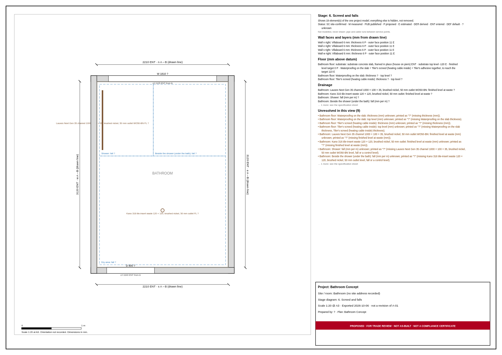

### Elevation wall_n (right side, from Bathroom)

[elevation-wall_n-right.svg](06-screed-falls/elevation-wall_n-right.svg)

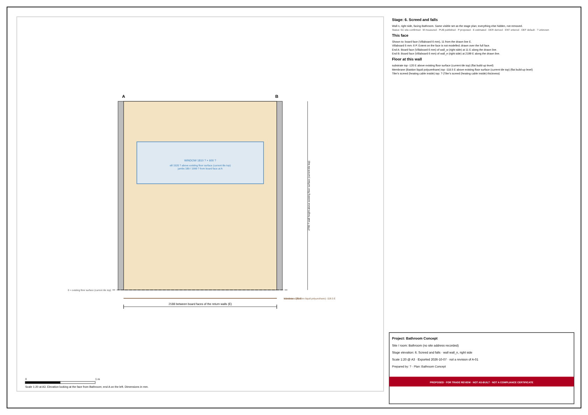

### Elevation wall_e (right side, from Bathroom)

[elevation-wall_e-right.svg](06-screed-falls/elevation-wall_e-right.svg)

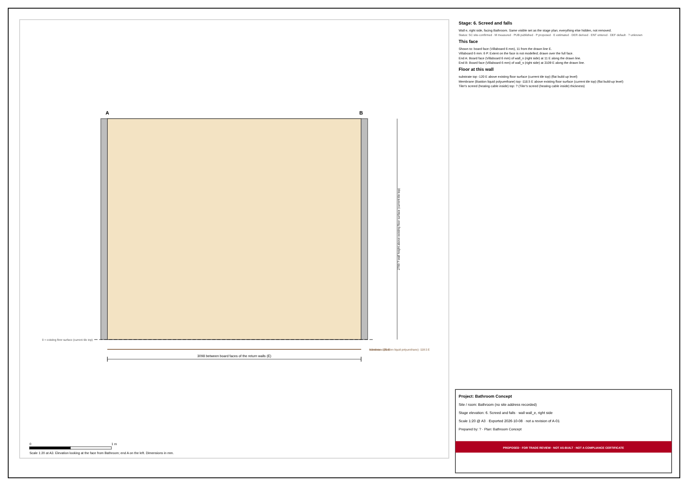

### Elevation wall_s (right side, from Bathroom)

[elevation-wall_s-right.svg](06-screed-falls/elevation-wall_s-right.svg)

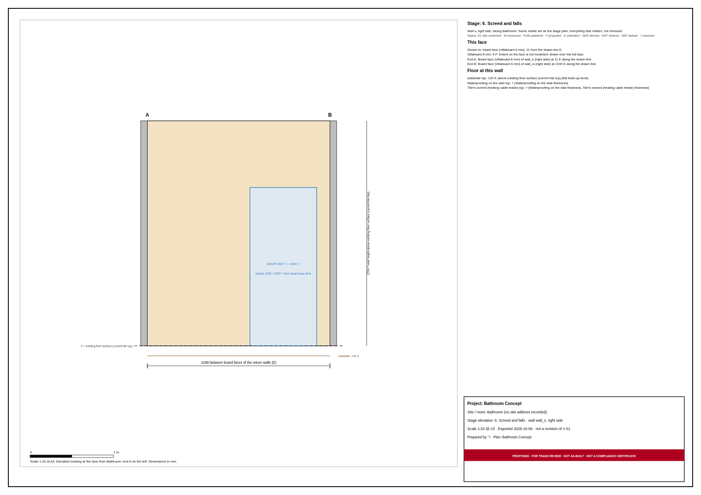

### Elevation wall_w (right side, from Bathroom)

[elevation-wall_w-right.svg](06-screed-falls/elevation-wall_w-right.svg)

## 7. Tile adhesive, floor and walls

Tile adhesive on the screed and on the wall board, ahead of the tiles.

Visible: `walls`, `wall-board`, `wall-adhesive`, `rooms`, `doors`, `windows`, `floor-substrate`, `floor-screed`, `floor-adhesive`, `drainage-wastes`, `drainage-planes`

Specification: 74 row(s), 24 unknown. [spec.html](07-adhesive/spec.html)

Open items:

- Bathroom floor: Tiler's screed (heating cable inside): thickness (mm) unknown; printed as "?" (missing thickness (mm)).
- Bathroom floor: Tiler's screed (heating cable inside): top level (mm) unknown; printed as "?" (missing Waterproofing on the slab thickness, Tiler's screed (heating cable inside) thickness).
- Bathroom floor: Tiler's adhesive: thickness (mm) unknown; printed as "?" (missing thickness (mm)).
- Bathroom: Lauxes Next Gen 35 channel 1000 × 100 × 35, brushed nickel, 50 mm outlet WO50-BN: finished level at waste (mm) unknown; printed as "?" (missing finished level at waste (mm)).
- Bathroom: Lauxes Next Gen 35 channel 1000 × 100 × 35, brushed nickel, 50 mm outlet WO50-BN: outlet position unknown; printed as "?" (missing outlet position along the channel (entered on the waste), outlet sideways offset (brief)).
- Bathroom: Kano 316 tile-insert waste 120 × 120, brushed nickel, 50 mm outlet: finished level at waste (mm) unknown; printed as "?" (missing finished level at waste (mm)).
- Bathroom: Kano 316 tile-insert waste 120 × 120, brushed nickel, 50 mm outlet: body depth below grate (mm) unknown; printed as "?" (missing installation depth not in the Kano 316 Tile Insert Waste 120×120, brushed nickel brief).
- Bathroom: Kano 316 tile-insert waste 120 × 120, brushed nickel, 50 mm outlet: outlet position unknown; printed as "?" (missing outlet sideways offset, outlet from body back edge, body depth (envelope) (brief)).
- Bathroom: Shower: fall (mm per m) unknown; printed as "?" (missing Lauxes Next Gen 35 channel 1000 × 100 × 35, brushed nickel, 50 mm outlet WO50-BN level, fall or a control level).
- Bathroom: Beside the shower (under the bath): fall (mm per m) unknown; printed as "?" (missing Kano 316 tile-insert waste 120 × 120, brushed nickel, 50 mm outlet level, fall or a control level).
- Bathroom: Dry area: fall (mm per m) unknown; printed as "?" (missing Kano 316 tile-insert waste 120 × 120, brushed nickel, 50 mm outlet level, fall or a control level).

Not modelled (never drawn):

- pipe and cable runs between service points (only the points are modelled)

### Plan

[plan.svg](07-adhesive/plan.svg)

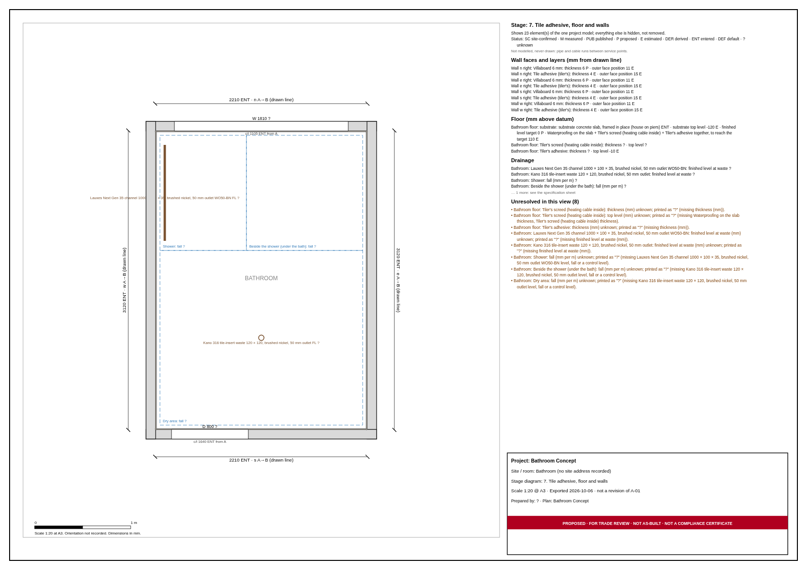

### Elevation wall_n (right side, from Bathroom)

[elevation-wall_n-right.svg](07-adhesive/elevation-wall_n-right.svg)

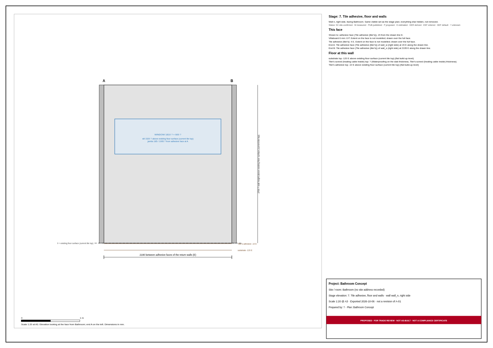

### Elevation wall_e (right side, from Bathroom)

[elevation-wall_e-right.svg](07-adhesive/elevation-wall_e-right.svg)

### Elevation wall_s (right side, from Bathroom)

[elevation-wall_s-right.svg](07-adhesive/elevation-wall_s-right.svg)

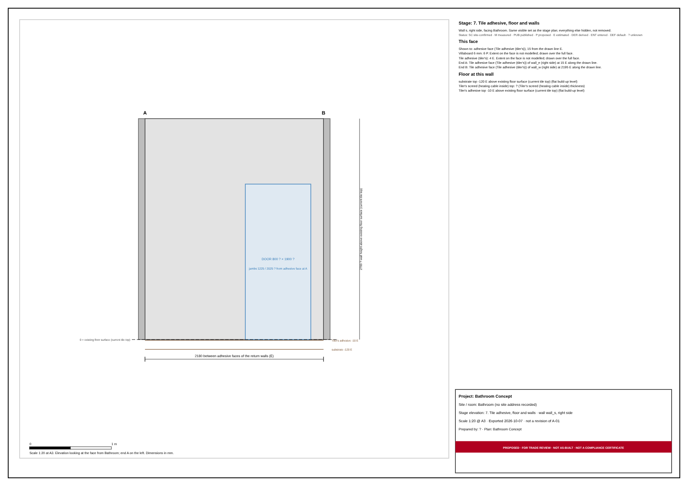

### Elevation wall_w (right side, from Bathroom)

[elevation-wall_w-right.svg](07-adhesive/elevation-wall_w-right.svg)

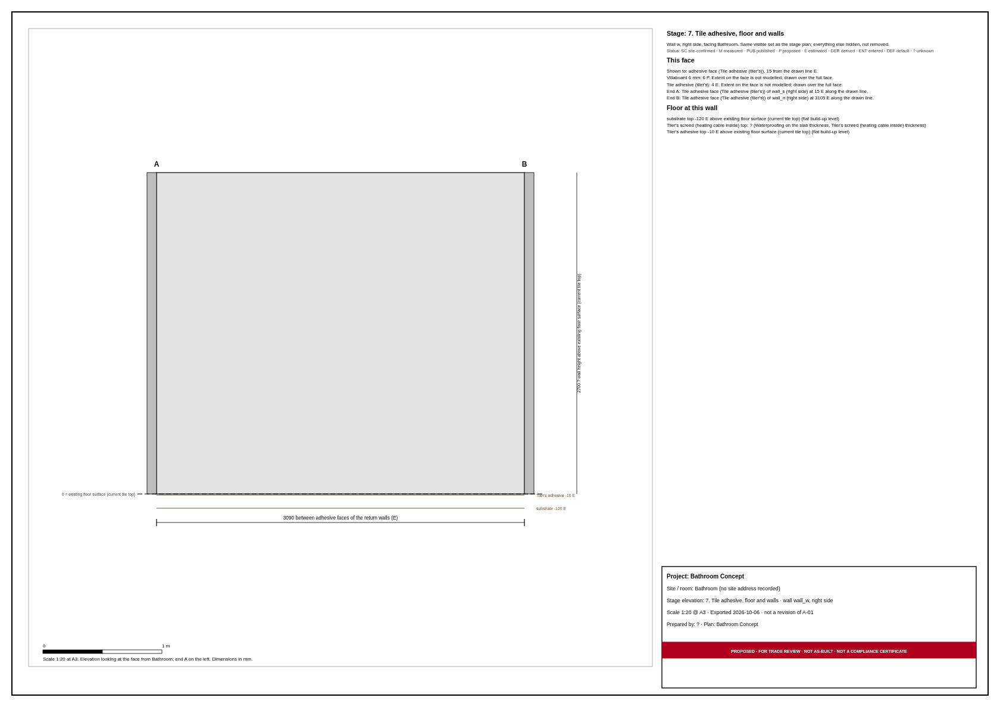

## 8. Tiles laid, floor and walls

Floor and wall tiles on the adhesive, with the proposed wall tile set-out and the finished floor falls.

Visible: `walls`, `wall-board`, `wall-adhesive`, `wall-tile`, `rooms`, `doors`, `windows`, `floor-substrate`, `floor-screed`, `floor-adhesive`, `floor-tile`, `drainage-wastes`, `drainage-planes`

Specification: 89 row(s), 24 unknown. [spec.html](08-tiles/spec.html)

Open items:

- Bathroom floor: Tiler's screed (heating cable inside): thickness (mm) unknown; printed as "?" (missing thickness (mm)).
- Bathroom floor: Tiler's screed (heating cable inside): top level (mm) unknown; printed as "?" (missing Waterproofing on the slab thickness, Tiler's screed (heating cable inside) thickness).
- Bathroom floor: Tiler's adhesive: thickness (mm) unknown; printed as "?" (missing thickness (mm)).
- Bathroom: Lauxes Next Gen 35 channel 1000 × 100 × 35, brushed nickel, 50 mm outlet WO50-BN: finished level at waste (mm) unknown; printed as "?" (missing finished level at waste (mm)).
- Bathroom: Lauxes Next Gen 35 channel 1000 × 100 × 35, brushed nickel, 50 mm outlet WO50-BN: outlet position unknown; printed as "?" (missing outlet position along the channel (entered on the waste), outlet sideways offset (brief)).
- Bathroom: Kano 316 tile-insert waste 120 × 120, brushed nickel, 50 mm outlet: finished level at waste (mm) unknown; printed as "?" (missing finished level at waste (mm)).
- Bathroom: Kano 316 tile-insert waste 120 × 120, brushed nickel, 50 mm outlet: body depth below grate (mm) unknown; printed as "?" (missing installation depth not in the Kano 316 Tile Insert Waste 120×120, brushed nickel brief).
- Bathroom: Kano 316 tile-insert waste 120 × 120, brushed nickel, 50 mm outlet: outlet position unknown; printed as "?" (missing outlet sideways offset, outlet from body back edge, body depth (envelope) (brief)).
- Bathroom: Shower: fall (mm per m) unknown; printed as "?" (missing Lauxes Next Gen 35 channel 1000 × 100 × 35, brushed nickel, 50 mm outlet WO50-BN level, fall or a control level).
- Bathroom: Beside the shower (under the bath): fall (mm per m) unknown; printed as "?" (missing Kano 316 tile-insert waste 120 × 120, brushed nickel, 50 mm outlet level, fall or a control level).
- Bathroom: Dry area: fall (mm per m) unknown; printed as "?" (missing Kano 316 tile-insert waste 120 × 120, brushed nickel, 50 mm outlet level, fall or a control level).

Not modelled (never drawn):

- pipe and cable runs between service points (only the points are modelled)

### Plan

[plan.svg](08-tiles/plan.svg)

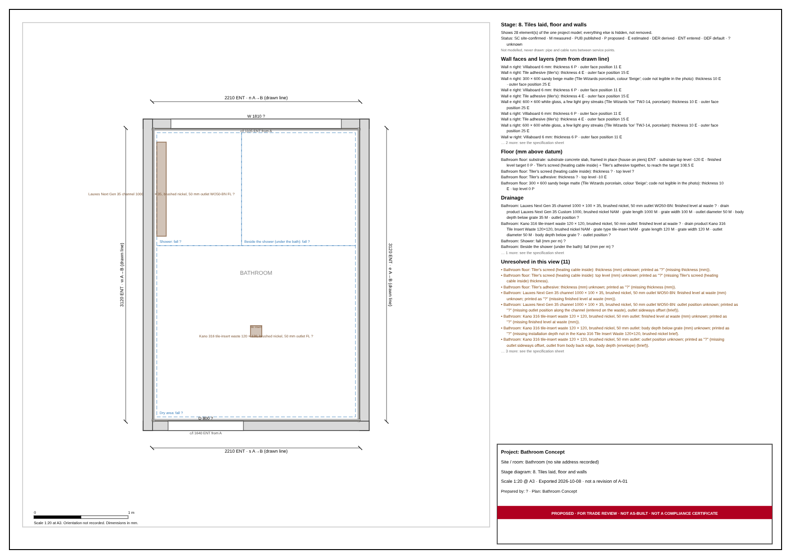

### Elevation wall_n (right side, from Bathroom)

[elevation-wall_n-right.svg](08-tiles/elevation-wall_n-right.svg)

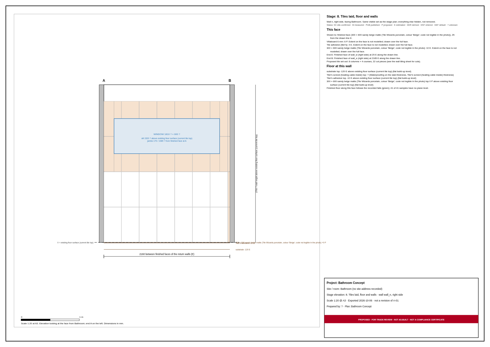

### Elevation wall_e (right side, from Bathroom)

[elevation-wall_e-right.svg](08-tiles/elevation-wall_e-right.svg)

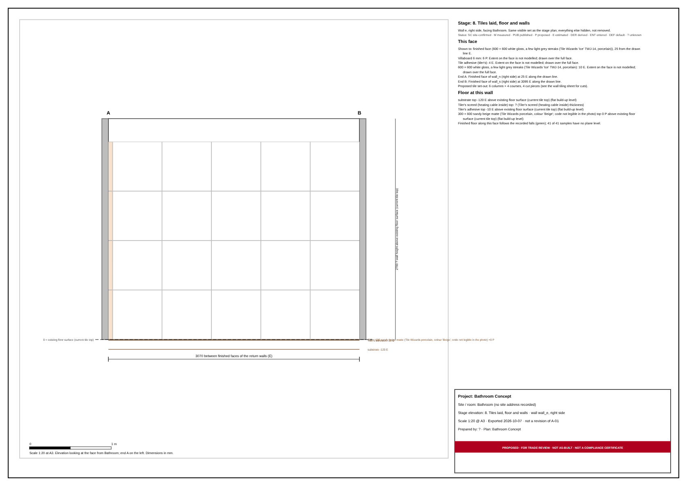

### Elevation wall_s (right side, from Bathroom)

[elevation-wall_s-right.svg](08-tiles/elevation-wall_s-right.svg)

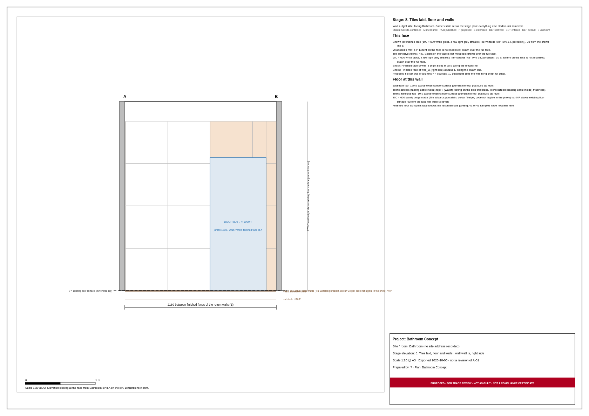

### Elevation wall_w (right side, from Bathroom)

[elevation-wall_w-right.svg](08-tiles/elevation-wall_w-right.svg)

## 9. Fit-out: fixtures without services (stopgap)

Stopgap view. The reused vanity, bath, toilet, screen, towel rails and the shaving cabinet last, on the tiled room. The sample records no service points for them, so the fixtures (dashed) are shown without services and the points are printed as not recorded.

Visible: `walls`, `wall-tile`, `rooms`, `doors`, `windows`, `floor-substrate`, `floor-tile`, `drainage-wastes`, `fixtures`

Stopgap view, not recorded: Waste service points; Water service points; Power service points. Drawn dashed as stand-ins: fixtures.

Specification: 291 row(s), 151 unknown. [spec.html](09-fit-out/spec.html)

Open items:

- Bathroom: Lauxes Next Gen 35 channel 1000 × 100 × 35, brushed nickel, 50 mm outlet WO50-BN: finished level at waste (mm) unknown; printed as "?" (missing finished level at waste (mm)).
- Bathroom: Lauxes Next Gen 35 channel 1000 × 100 × 35, brushed nickel, 50 mm outlet WO50-BN: outlet position unknown; printed as "?" (missing outlet position along the channel (entered on the waste), outlet sideways offset (brief)).
- Bathroom: Kano 316 tile-insert waste 120 × 120, brushed nickel, 50 mm outlet: finished level at waste (mm) unknown; printed as "?" (missing finished level at waste (mm)).
- Bathroom: Kano 316 tile-insert waste 120 × 120, brushed nickel, 50 mm outlet: body depth below grate (mm) unknown; printed as "?" (missing installation depth not in the Kano 316 Tile Insert Waste 120×120, brushed nickel brief).
- Bathroom: Kano 316 tile-insert waste 120 × 120, brushed nickel, 50 mm outlet: outlet position unknown; printed as "?" (missing outlet sideways offset, outlet from body back edge, body depth (envelope) (brief)).
- Corner bath (bath): set-out unknown; printed as "?" (missing not set out from a wall face).
- Corner bath (bath): wasteFromEnd unknown; printed as "?" (missing Sheet gives 520 mm from the right-angle corner along the bisector, not from the end. Along each wall that is 520/√2 ≈ 367.7 mm; that conversion is derived in the host-frame check, not entered as published wasteFromEnd.).
- Corner bath (bath): wasteEnd unknown; printed as "?" (missing Not entered from the cited source.).
- Corner bath (bath): wasteFromSide unknown; printed as "?" (missing Sheet gives 520 mm from the right-angle corner along the bisector, not from the side. Along each wall that is 520/√2 ≈ 367.7 mm; that conversion is derived in the host-frame check, not entered as published wasteFromSide.).
- Corner bath (bath): wasteConnectionDiameter unknown; printed as "?" (missing The Enflair drawing names a Ø50 waste hole, not a pipe connection or outlet size. No connection diameter is entered.).
- Corner bath (bath): surround unknown; printed as "?" (missing Not entered from the cited source.).
- Corner bath (bath): surroundDetail unknown; printed as "?" (missing Not entered from the cited source.).
- Bath mixer (bath_mixer): set-out unknown; printed as "?" (missing not set out from a wall face).
- Bath mixer (bath_mixer): tapHoles unknown; printed as "?" (missing Not entered from the cited source.).
- Bath mixer (bath_mixer): holeLayout unknown; printed as "?" (missing Not entered from the cited source.).
- Bath mixer (bath_mixer): fixingLayout unknown; printed as "?" (missing Not entered from the cited source.).
- Bath mixer (bath_mixer): pressureMin unknown; printed as "?" (missing Not entered from the cited source.).
- Bath mixer (bath_mixer): inletMode unknown; printed as "?" (missing Not entered from the cited source.).
- Bath mixer (bath_mixer): inletSpacing unknown; printed as "?" (missing Not entered from the cited source.).
- Bath mixer (bath_mixer): waterConnection unknown; printed as "?" (missing Not entered from the cited source.).
- Bath mixer (bath_mixer): inletOffset unknown; printed as "?" (missing Not entered from the cited source.).
- Bath mixer (bath_mixer): inletDepth unknown; printed as "?" (missing Not entered from the cited source.).
- Bath mixer (bath_mixer): inletHeight unknown; printed as "?" (missing Not entered from the cited source.).
- Bath mixer (bath_mixer): concealedDepthMin unknown; printed as "?" (missing Not entered from the cited source.).
- Bath mixer (bath_mixer): concealedDepthMax unknown; printed as "?" (missing Not entered from the cited source.).
- Bath spout (bath_spout): set-out unknown; printed as "?" (missing not set out from a wall face).
- Bath spout (bath_spout): tapHoles unknown; printed as "?" (missing Not entered from the cited source.).
- Bath spout (bath_spout): holeLayout unknown; printed as "?" (missing Not entered from the cited source.).
- Bath spout (bath_spout): fixingLayout unknown; printed as "?" (missing Not entered from the cited source.).
- Bath spout (bath_spout): pressureMin unknown; printed as "?" (missing Not entered from the cited source.).
- Bath spout (bath_spout): pressureMax unknown; printed as "?" (missing Not entered from the cited source.).
- Bath spout (bath_spout): temperatureMax unknown; printed as "?" (missing Not entered from the cited source.).
- Bath spout (bath_spout): inletMode unknown; printed as "?" (missing Not entered from the cited source.).
- Bath spout (bath_spout): inletSpacing unknown; printed as "?" (missing Not entered from the cited source.).
- Bath spout (bath_spout): inletOffset unknown; printed as "?" (missing Not entered from the cited source.).
- Bath spout (bath_spout): inletDepth unknown; printed as "?" (missing Not entered from the cited source.).
- Bath spout (bath_spout): inletHeight unknown; printed as "?" (missing Not entered from the cited source.).
- Bath spout (bath_spout): concealedDepthMin unknown; printed as "?" (missing Not entered from the cited source.).
- Bath spout (bath_spout): concealedDepthMax unknown; printed as "?" (missing Not entered from the cited source.).
- Bath waste (bath_waste): set-out unknown; printed as "?" (missing not set out from a wall face).
- Bath waste (bath_waste): width unknown; printed as "?" (missing Not entered from the cited source.).
- Bath waste (bath_waste): depth unknown; printed as "?" (missing Not entered from the cited source.).
- Bath waste (bath_waste): height unknown; printed as "?" (missing Not entered from the cited source.).
- Bath waste (bath_waste): outletDiameter unknown; printed as "?" (missing Carton prints 40 mm nominal connection; no manufacturer sheet, so not entered as a published figure).
- Bath waste (bath_waste): overflow unknown; printed as "?" (missing Not entered from the cited source.).
- Basin mixer (basin_mixer): set-out unknown; printed as "?" (missing not set out from a wall face).
- Basin mixer (basin_mixer): fixingLayout unknown; printed as "?" (missing Not entered from the cited source.).
- Basin mixer (basin_mixer): pressureMin unknown; printed as "?" (missing Not entered from the cited source.).
- Basin mixer (basin_mixer): inletMode unknown; printed as "?" (missing Not entered from the cited source.).
- Basin mixer (basin_mixer): inletSpacing unknown; printed as "?" (missing Not entered from the cited source.).
- Basin mixer (basin_mixer): waterConnection unknown; printed as "?" (missing Not entered from the cited source.).
- Basin mixer (basin_mixer): inletOffset unknown; printed as "?" (missing Not entered from the cited source.).
- Basin mixer (basin_mixer): inletDepth unknown; printed as "?" (missing Not entered from the cited source.).
- Basin mixer (basin_mixer): inletHeight unknown; printed as "?" (missing Not entered from the cited source.).
- Basin mixer (basin_mixer): concealedDepthMin unknown; printed as "?" (missing Not entered from the cited source.).
- Basin mixer (basin_mixer): concealedDepthMax unknown; printed as "?" (missing Not entered from the cited source.).
- Shower system (shower_system): set-out unknown; printed as "?" (missing not set out from a wall face).
- Shower system (shower_system): pressureMin unknown; printed as "?" (missing Not entered from the cited source.).
- Shower system (shower_system): pressureMax unknown; printed as "?" (missing Not entered from the cited source.).
- Shower system (shower_system): temperatureMax unknown; printed as "?" (missing Not entered from the cited source.).
- Shower system (shower_system): adjustmentMin unknown; printed as "?" (missing Not entered from the cited source.).
- Shower system (shower_system): adjustmentMax unknown; printed as "?" (missing Not entered from the cited source.).
- Shower system (shower_system): inletOffset unknown; printed as "?" (missing Not entered from the cited source.).
- Shower system (shower_system): inletDepth unknown; printed as "?" (missing Not entered from the cited source.).
- Shower system (shower_system): inletHeight unknown; printed as "?" (missing Not entered from the cited source.).
- Towel rail (towel_rail): set-out unknown; printed as "?" (missing not set out from a wall face).
- Towel rail (towel_rail): fixingCentresWidth unknown; printed as "?" (missing Not entered from the cited source.).
- Towel rail (towel_rail): powerOffset unknown; printed as "?" (missing Not entered from the cited source.).
- Towel rail (towel_rail): powerHeight unknown; printed as "?" (missing Not entered from the cited source.).
- Towel rail (towel_rail): powerDepth unknown; printed as "?" (missing Not entered from the cited source.).
- Towel rail (towel_rail): waterConnection unknown; printed as "?" (missing Not entered from the cited source.).
- Towel rail (towel_rail_2): set-out unknown; printed as "?" (missing not set out from a wall face).
- Towel rail (towel_rail_2): fixingCentresWidth unknown; printed as "?" (missing Not entered from the cited source.).
- Towel rail (towel_rail_2): powerOffset unknown; printed as "?" (missing Not entered from the cited source.).
- Towel rail (towel_rail_2): powerHeight unknown; printed as "?" (missing Not entered from the cited source.).
- Towel rail (towel_rail_2): powerDepth unknown; printed as "?" (missing Not entered from the cited source.).
- Towel rail (towel_rail_2): waterConnection unknown; printed as "?" (missing Not entered from the cited source.).
- Vanity (vanity): set-out unknown; printed as "?" (missing not set out from a wall face).
- Shaving cabinet (shaving_cabinet): set-out unknown; printed as "?" (missing not set out from a wall face).
- Toilet (toilet): set-out unknown; printed as "?" (missing not set out from a wall face).
- Fixed glass screen (screen): set-out unknown; printed as "?" (missing not set out from a wall face).

Not modelled (never drawn):

- pipe and cable runs between service points (only the points are modelled)

### Plan

[plan.svg](09-fit-out/plan.svg)

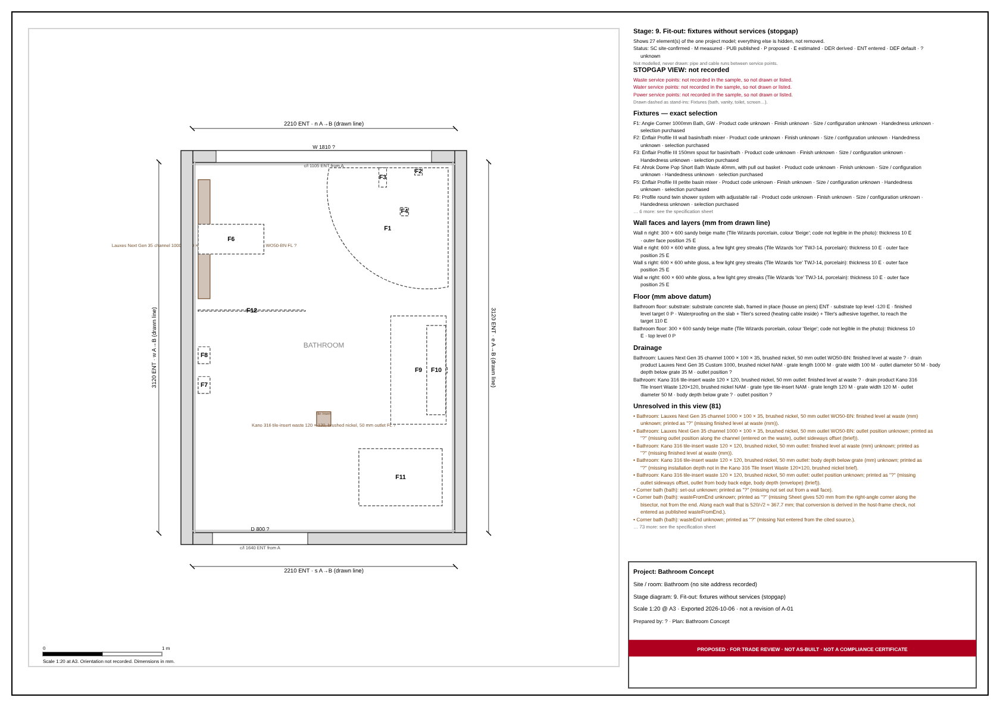

### Elevation wall_n (right side, from Bathroom)

[elevation-wall_n-right.svg](09-fit-out/elevation-wall_n-right.svg)

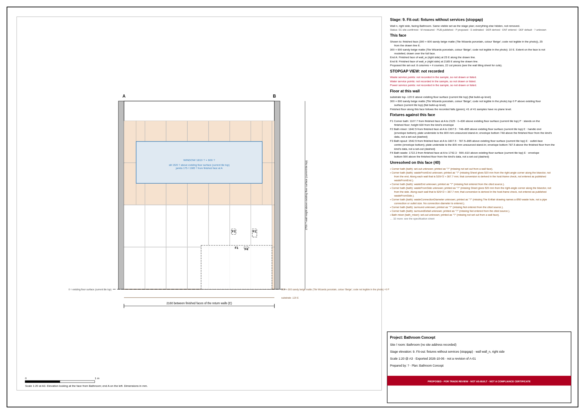

### Elevation wall_e (right side, from Bathroom)

[elevation-wall_e-right.svg](09-fit-out/elevation-wall_e-right.svg)

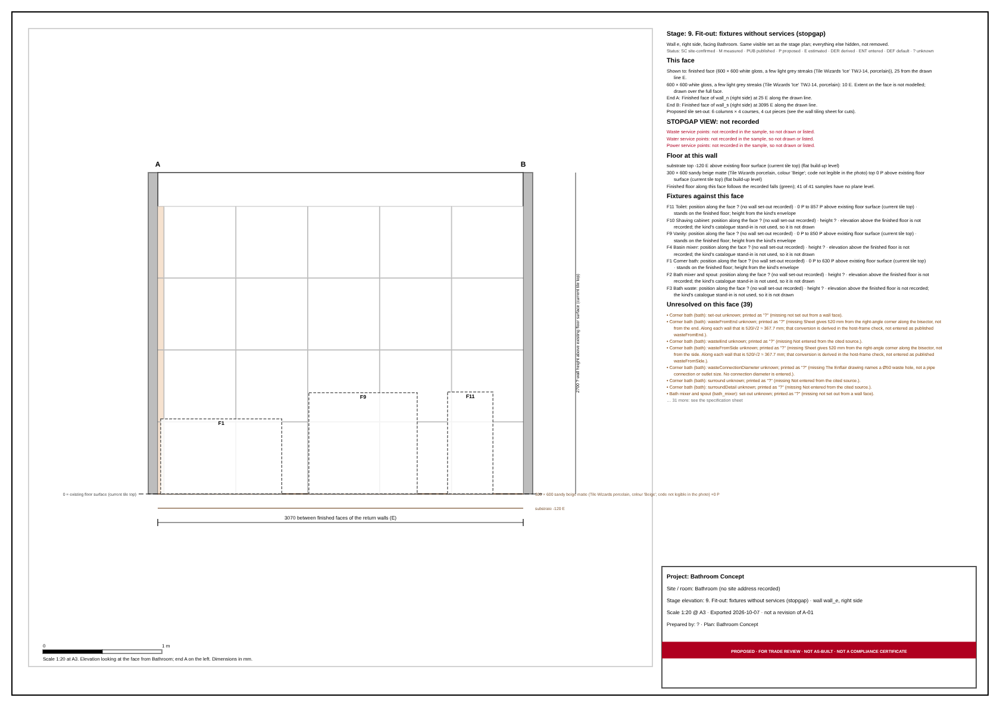

### Elevation wall_s (right side, from Bathroom)

[elevation-wall_s-right.svg](09-fit-out/elevation-wall_s-right.svg)

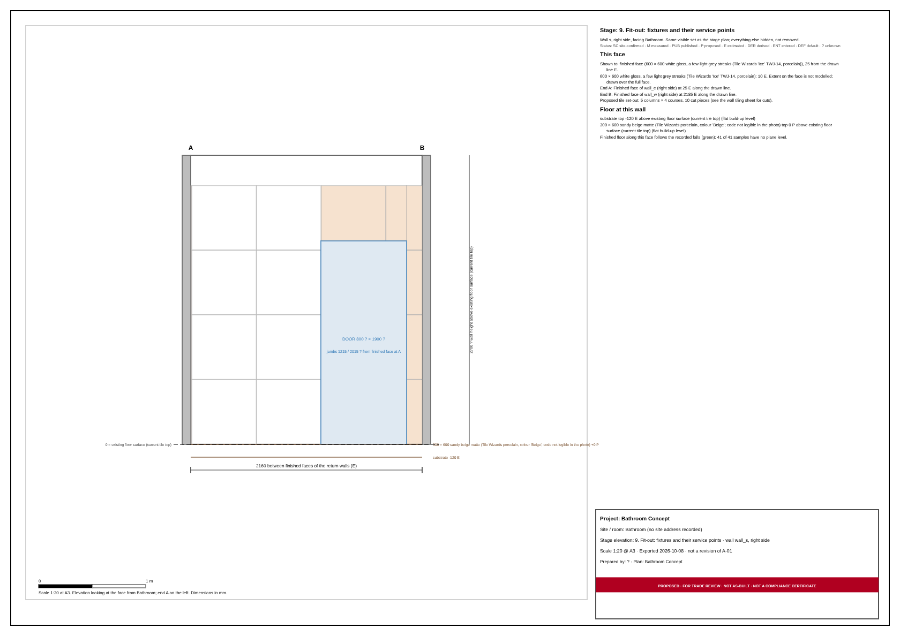

### Elevation wall_w (right side, from Bathroom)

[elevation-wall_w-right.svg](09-fit-out/elevation-wall_w-right.svg)

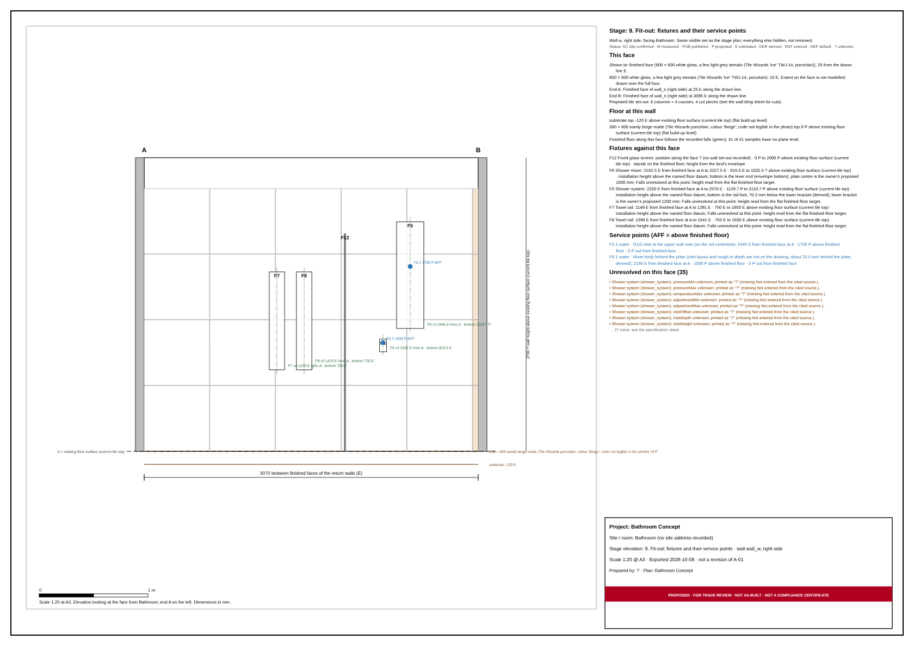
