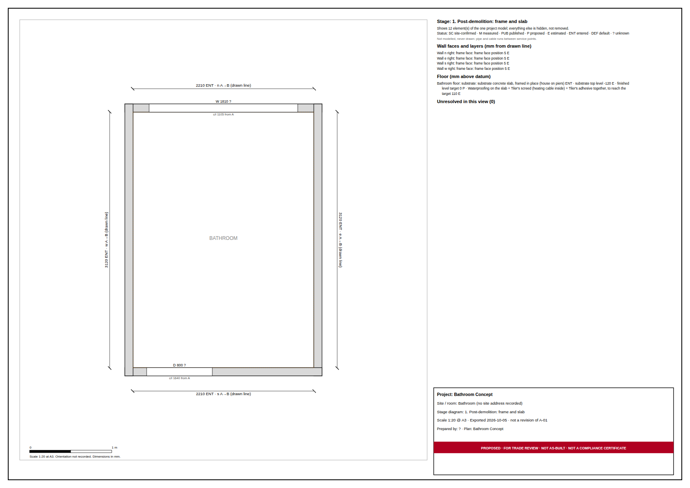
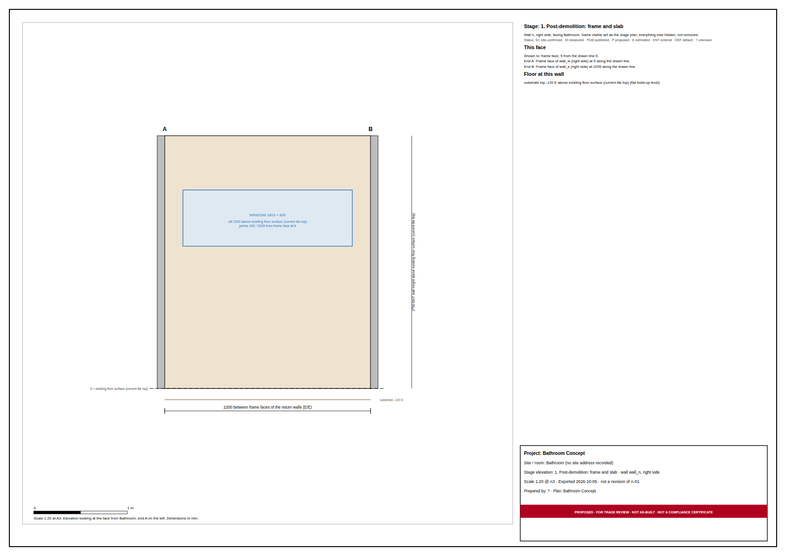
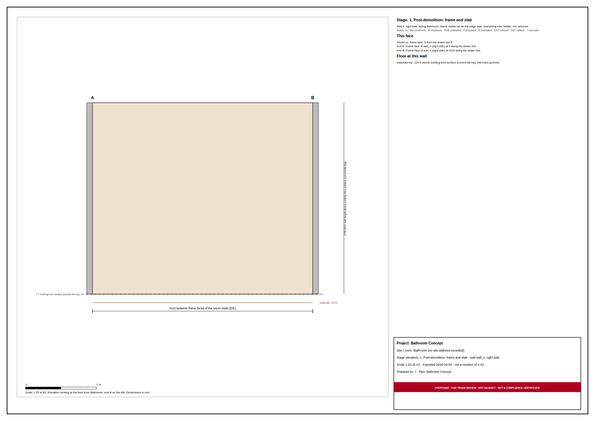
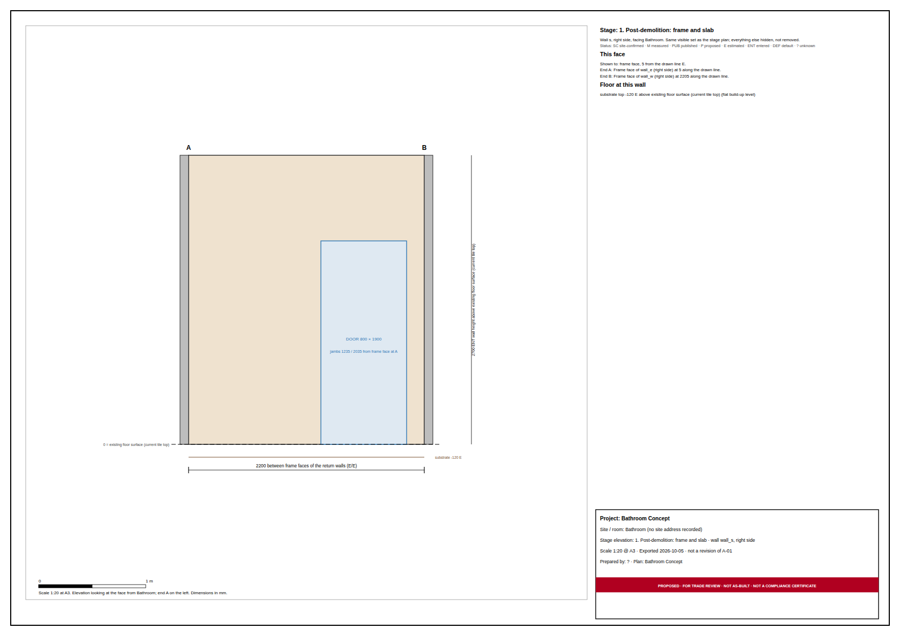
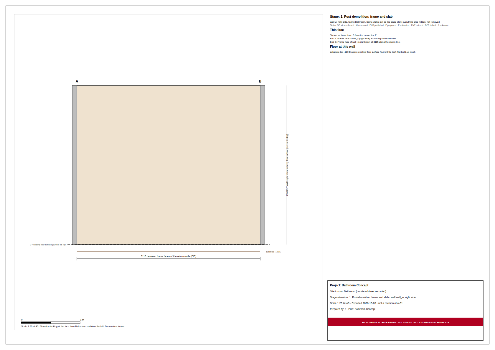

# Stage diagram pack: Bathroom Concept

Generated by `npm run stage-pack` from the shipped sample. Each phase is a stage view: the same model with only the listed layers visible. Nothing in the model is edited to make a phase look right.

Every drawing is proposed set-out for trade review, not a compliance certificate. Values print with their status tag and datum; "?" means unknown.

## 1. Post-demolition: frame and slab

Walls stripped to the timber frame and the floor taken back to the concrete slab, about 120 mm below the current tile (estimated; confirm after demolition). The door and window openings stay as openings in the frame.

Visible: `walls`, `wall-frame`, `rooms`, `doors`, `windows`, `floor-substrate`

Specification: 28 row(s), 0 unknown. [spec.html](01-post-demolition/spec.html)

Not modelled (never drawn):

- pipe and cable runs between service points (only the points are modelled)

### Plan

[plan.svg](01-post-demolition/plan.svg)

### Elevation wall_n (right side, from Bathroom)

[elevation-wall_n-right.svg](01-post-demolition/elevation-wall_n-right.svg)

### Elevation wall_e (right side, from Bathroom)

[elevation-wall_e-right.svg](01-post-demolition/elevation-wall_e-right.svg)

### Elevation wall_s (right side, from Bathroom)

[elevation-wall_s-right.svg](01-post-demolition/elevation-wall_s-right.svg)

### Elevation wall_w (right side, from Bathroom)

[elevation-wall_w-right.svg](01-post-demolition/elevation-wall_w-right.svg)

